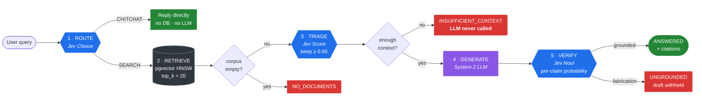

<div align="center">


**A precision-first RAG orchestrator. It filters before it generates, and verifies before it answers.**

[](https://github.com/david96182/cribrix/actions/workflows/ci.yml)
[](https://www.python.org/downloads/)
[](https://github.com/astral-sh/ruff)
[](LICENSE)

*From Latin* **cribrum** — *a sieve.*

</div>

---

## The problem

Most RAG systems are built to *always answer*. Retrieve the top-k chunks, stuff
them into a prompt, return whatever comes out. This works right up until the
corpus doesn't contain the answer — at which point the system confidently
invents one, attaches a real citation, and the user has no way to tell.

The failure isn't the language model. It's the architecture: **nothing in the
pipeline is allowed to say "no".**

## The approach

Cribrix wraps a conventional LLM in a **System 1 / System 2** loop. A fast,
structured-output decision model ([Jev](https://typesafe.ai), System 1) gates an
expensive generative model (System 2) on both sides:



<div align="center">
<sub><b>Blue</b> = System 1 (Jev: fast, typed, cheap) · <b>Purple</b> = System 2 (the LLM) · <b>Red</b> = a refusal</sub>
</div>

Three gates, three ways to refuse — and each refusal is a *distinct*
`AnswerStatus`, because "the corpus is empty", "nothing was relevant" and "the
draft was unsupported" are three different bugs with three different fixes.

---

## The three failure modes, measured live

Run `make scenarios-live`. Every number below is **real output** from the live
TypeSafe Jev API and a live LLM over OpenRouter — not estimates.

### Scenario 1 — The Chitchat Trap

> *"Hey, I'm having a rough morning, how are you?"*

| | Naive RAG | Cribrix |
|---|---|---|
| Searched the DB | yes | **no** |
| LLM called | yes | **no** |
| Prompt tokens | ~135 | **0** (−100%) |
| Latency | 7,622 ms | **533 ms** |

Naive RAG vector-searched *"rough morning"*, pulled the **HR attendance policy,
the grievance procedure and the employee counselling programme**, and answered a
greeting with corporate policy. One run replied:

> *"I'm here to help you get through this rough morning. If you'd like some
> support, the employee wellbeing programme offers confidential counselling…"*

Jev's `Choice` classified `CHITCHAT` at **confidence 1.00** and skipped both the
database and the generator.

### Scenario 2 — The Keyword Mirage

> *"What laptop does the engineering team use?"*

Live Jev `Score` output, normalised:

```
[KEEP] rel=1.00   The engineering team uses MacBook Pro M3s.
[DROP] rel=0.19   The marketing team uses MacBook Airs.      <- lexical neighbour
[DROP] rel=0.00   The cafeteria is now serving mac and cheese. <- vector noise
```

| | Naive RAG | Cribrix |
|---|---|---|
| Chunks → LLM | 3 | **1** |
| Prompt tokens | ~69 | **~36** (−48%) |

Both produced the right answer here, but naive RAG paid ~2x the input tokens and
handed the model a passage attributing a *different* laptop to a *different*
team — the setup for a wrong answer on any less trivial query.

### Scenario 3 — The Confident Hallucination

> *"What is the exact percentage of the annual bonus?"*
> Corpus: *"…a generous annual performance bonus. The exact percentage is decided by the board every December."*

**Honest finding: the live model did not hallucinate.** `nemotron-3-super-120b`
correctly answered *"the context does not specify the exact percentage."* Modern
instruction-tuned models are better at this than the scenario assumes, and
rigging the prompt until it failed would be measuring theatre.

So the suite reports what the model actually did, then probes the gate directly
with a hand-written fabrication. That isolates the question Cribrix is
responsible for: *if* a fabrication reaches the gate, does the gate stop it?

```
adversarial probe: "The company offers an annual performance bonus of 10%.
                    The board reviews it every December."

  [BAD] p=0.02   The company offers an annual performance bonus of 10%.
  [OK ] p=0.62   The board reviews it every December.
  >> gate verdict: BLOCKED
```

Live Jev `Noul` scored the fabricated figure at **0.02** and the supported claim
at **0.62**. The answer is withheld and the user gets the refusal string.

---

## Golden-set evaluation

`make eval` — 9 labelled questions, half deliberately unanswerable:

| Metric | baseline | cribrix |
|---|---:|---:|
| Overall status accuracy | 66.7% | **100.0%** |
| Answerable correct | 100.0% | 100.0% |
| Refusal accuracy | 0.0% | **100.0%** |
| **Hallucination rate** | **100.0%** | **0.0%** |
| Triage precision | 0.20 | **0.875** |
| Triage recall | 1.00 | **1.00** |

`baseline` is naive RAG: top-5, no triage, no verification. It answers **every**
unanswerable question, because it structurally cannot do otherwise.

---

## The Jev integration

Jev exposes a single call, `system_one(state, questions)`, taking a *mapping* of
named questions. Two return types are easy to misread, and both are load-bearing.

### 1. `Score` is **ordinal**, not a 0–1 float

`Score(criteria=[...])` returns *an index into your rubric*. With the 4-level
rubric Cribrix uses, a direct answer scores **3.0**, not 0.98.

```python
# WRONG - every chunk survives, triage silently becomes a no-op
if answer.score >= 0.7: keep(chunk)     # 3.0 >= 0.7, and so is 1.0

# RIGHT
normalised = raw / (len(rubric) - 1)     # 3.0 -> 1.00, 1.0 -> 0.33
```

This is the most dangerous misreading: nothing errors, the pipeline
looks healthy, and the filtering stage quietly stops filtering.
`test_raw_ordinal_would_defeat_the_threshold` guards it.

**Consequence:** normalised scores land on discrete steps — `0, 0.33, 0.67, 1.0`.
A threshold must sit *between* two steps. The default is **0.65**, not 0.7,
because 0.7 falls in the dead zone just above the 0.67 step. Measured:

| threshold | 0.30 | 0.50 | 0.60 | **0.65** | 0.70 | 0.90 |
|---|---|---|---|---|---|---|
| accuracy | 100% | 100% | 100% | **100%** | 77.8% | 77.8% |

That cliff is not noise — it is the rubric's granularity. `make eval-sweep`.

### 2. `Noul` is a **probability**, not a boolean

`NoulAnswer.noul` is a float in [0, 1] (observed: **0.02** for a fabrication,
**0.98** for a supported claim). That's strictly richer than a bool: Cribrix
keeps the raw probability on every `ClaimVerdict`, so a trace shows *how
confident* a rejection was. `CRIBRIX_NOUL_THRESHOLD` owns the cut-off.

---

## Multi-provider LLM support

| Provider | Value | Client |
|---|---|---|
| OpenAI | `openai` | OpenAI-compatible |
| Anthropic | `anthropic` | dedicated |
| OpenRouter | `openrouter` | OpenAI-compatible |
| Together / Groq / Ollama | `together` `groq` `ollama` | OpenAI-compatible |
| Anything else | `custom` + `CRIBRIX_LLM_BASE_URL` | OpenAI-compatible |

```bash
CRIBRIX_LLM_PROVIDER=anthropic
CRIBRIX_LLM_API_KEY=sk-ant-...
CRIBRIX_LLM_MODEL=claude-sonnet-4-20250514
```

Six providers, **two** implementations. OpenAI, OpenRouter, Together, Groq,
Ollama, vLLM and LM Studio all speak the same `POST /chat/completions` format —
one client covers them, differing only in base URL and default model. Anthropic
is the genuine exception (`x-api-key`, `anthropic-version`, top-level `system`,
different response shape) and gets its own.

Transient upstream failures (429/502/503 — routine on free tiers) are retried
with exponential backoff, including gateways that return HTTP 200 wrapping an
error envelope.

---

## Quickstart

### 1. Try it with zero setup

No Docker, no database, no API keys, no network:

```bash
git clone https://github.com/david96182/cribrix.git && cd cribrix
cp .env.example .env
make install
make scenarios      # the 3 failure modes, side by side
make eval           # naive RAG vs Cribrix, scored
make test           # 155 tests
```

`make scenarios` is the fastest way to see the point of the project.

### 2. Run the full stack

```bash
make up             # Postgres + pgvector + the API
make seed           # loads 20 demo chunks, then runs a guided tour
```

`make seed` ships a **ready-to-query corpus** — billing tiers, a security
whitepaper, an SLA, API docs, HR policies — so there is something to interrogate
immediately. It then walks 7 questions chosen to hit a different branch each:

```
  [PASS] What is the refund window for enterprise plans?
         actual   : ANSWERED          retrieved=20 kept=1 groundedness=1.0
  [PASS] What was the company's total revenue in 2019?
         actual   : INSUFFICIENT_CONTEXT   retrieved=20 kept=0
         why      : Entirely absent. Naive RAG answers anyway; Cribrix refuses.
  [PASS] Hey, I'm having a rough morning, how are you?
         actual   : CHITCHAT          retrieved=0 kept=0
         why      : Retrieval is skipped entirely; no LLM call is made.
```

### 3. Ask your own questions

```bash
make ask Q="what is the API rate limit?"
```

which prints the full decision trace, not just an answer:

```
  ANSWERED   verified=True
  answer: The rate limit for the public API is 1000 requests per minute per API key.

  1 route      SEARCH (confidence 0.98)
  2 retrieve   20 candidate chunks
  3 triage     kept 1/20
      [KEEP] 1.00  The rate limit for the public API is 1000 requests per m
      [drop] 0.03  Enterprise support responds to critical incidents within
      [drop] 0.00  The cafeteria is now serving mac and cheese on Thursdays.
  5 verify     groundedness 100%
      [OK ] p=0.99  The rate limit for the public API is 1000 requests per min
  sources      api-reference
  timing       routing=170ms retrieval=12ms triage=845ms verification=283ms
```

Try these to feel the difference:

| Question | What you should see |
|---|---|
| `what laptop does the engineering team use?` | Keeps 1 chunk, drops "MacBook Airs" and "mac and cheese" |
| `what was revenue in 2019?` | `INSUFFICIENT_CONTEXT` — refuses **without calling the LLM** |
| `what is the penalty for early termination?` | **Answers from the refund policy — a genuine near-miss failure.** See the note below. |
| `how much annual leave do I get?` | `ANSWERED` from the HR policy |
| `thanks, that was helpful!` | `CHITCHAT` — no retrieval at all |

Or use the interactive docs at **`http://localhost:8000/docs`**.

> **On that fourth row — an honest failure.** *"What is the penalty for early
> termination?"* is not answered anywhere in the corpus, yet Cribrix answers it
> with the refund policy. Measured scores for the refund chunk:
> **0.69 offline, 0.71 with live Jev.** Both clear the 0.65 threshold.
>
> This is the system's real boundary, not a bug in the demo: *"refund window"*
> and *"termination penalty"* are genuinely close in contract-language space,
> and relevance scoring is not the same thing as answerability. The gate then
> confirms the answer is grounded — which it is. **It is faithfully grounded in
> the wrong passage.**
>
> Raising the threshold to `0.75` makes this case refuse correctly, at the cost
> of recall elsewhere. Run `make eval-sweep` to see that trade. This is exactly
> the "groundedness is not correctness" limitation documented below, and it is
> left in the demo deliberately rather than tuned away.

### 4. Point it at real models

```bash
# .env
CRIBRIX_JEV_MODE=live
CRIBRIX_JEV_[ENVIRONMENT VARIABLE SECRET_REDACTED]

CRIBRIX_LLM_PROVIDER=openrouter        # or openai / anthropic / groq / ollama / custom
CRIBRIX_LLM_[ENVIRONMENT VARIABLE SECRET_REDACTED]
CRIBRIX_LLM_MODEL=nvidia/nemotron-3-super-120b-a12b:free
```

```bash
make scenarios-live    # the 3 scenarios against real APIs
```

### 5. Load your own documents

```bash
# Embedded server-side with the configured embedder
curl -X POST "http://localhost:8000/ingest/text?document_id=my-doc" \
  -H 'content-type: application/json' \
  -d '["First chunk of text.", "Second chunk of text."]'

# Or supply your own vectors
curl -X POST http://localhost:8000/ingest \
  -H 'content-type: application/json' \
  -d '{"chunks":[{"document_id":"my-doc","content":"...","embedding":[0.1, ...]}]}'
```

`make reseed` wipes and reloads the demo corpus whenever you want a clean slate.

---

## Configuration

Everything lives in `.env`. The knobs worth knowing:

| Variable | Default | What it does |
|---|---|---|
| `CRIBRIX_API_PORT` | `8000` | Host port for the API |
| `CRIBRIX_DB_PORT` | `5432` | Host port for Postgres |
| `CRIBRIX_RELEVANCE_THRESHOLD` | `0.65` | Triage cut-off — **see the ordinal note below** |
| `CRIBRIX_RETRIEVAL_TOP_K` | `20` | Retrieve wide, filter hard |
| `CRIBRIX_MIN_CHUNKS_REQUIRED` | `1` | Below this, refuse without calling the LLM |
| `CRIBRIX_VERIFICATION_MODE` | `atomic` | `atomic` (per claim) or `holistic` |
| `CRIBRIX_NOUL_THRESHOLD` | `0.5` | Grounded-probability cut-off |
| `CRIBRIX_FAIL_OPEN_ON_VERIFIER_ERROR` | `false` | Fail-closed by default |
| `CRIBRIX_JEV_MODE` | `fake` | `fake` (offline) or `live` |
| `CRIBRIX_LLM_PROVIDER` | `fake` | `openai` `anthropic` `openrouter` `groq` `ollama` `custom` |

---

---

## Design decisions worth defending

<details>
<summary><b>Atomic claim verification, not one boolean over the whole answer</b></summary>

A single check over the full draft rejects a 4-sentence answer where 3 sentences
are correct — so the system feels broken and users route around it. Cribrix
splits the draft into sentence-level claims, verifies each concurrently, and
gates on the grounded *fraction*. Scenario 3's probe shows exactly why: the
fabricated sentence scored 0.02 while its neighbour scored 0.62. Set
`CRIBRIX_VERIFICATION_MODE=holistic` to compare.
</details>

<details>
<summary><b>Refuse before generating, not after</b></summary>

If triage keeps nothing, the naive move is to call the LLM anyway with empty
context — a hallucination generator inside the anti-hallucination system.
`min_chunks_required` short-circuits *before* generation.
`test_irrelevant_corpus_refuses_without_calling_the_llm` asserts
`llm.call_count == 0`.
</details>

<details>
<summary><b>Routing fails towards SEARCH</b></summary>

The costs are asymmetric. CHITCHAT misrouted to SEARCH wastes a retrieval.
SEARCH misrouted to CHITCHAT answers a real question with no grounding and no
fact-check. So the failure direction isn't symmetric either: on any router
error, Cribrix defaults to SEARCH.
</details>

<details>
<summary><b>Fail-closed by default, and configurable</b></summary>

If the verifier is unreachable, return an unverified answer or refuse? That's a
product decision, not an exception handler. `CRIBRIX_FAIL_OPEN_ON_VERIFIER_ERROR`,
default `false`.
</details>

<details>
<summary><b>The baseline uses a fair prompt</b></summary>

The naive comparison runs a generic "helpful assistant + context" prompt — what
tutorials actually ship. Giving the baseline Cribrix's carefully hedged prompt
would measure the prompt, not the architecture. See `NAIVE_SYSTEM_PROMPT`.
</details>

---

## Known limitations

- **Groundedness is not correctness.** A verified answer can still be wrong if
  retrieval surfaced the wrong-but-real passage. Verification proves an answer
  is supported by the *retrieved* context; it cannot prove that was the *right*
  context. No fact-check fixes a retrieval failure.
- **Modern LLMs hallucinate less than this project assumes.** Scenario 3's live
  model refused honestly and unprompted. The value of the gate is in the tail:
  weaker models, adversarial inputs, longer multi-claim answers.
- **Multi-hop questions.** Per-chunk scoring cannot handle facts that are
  individually irrelevant but jointly sufficient. Each scores low and is filtered.
- **Sentence-splitting ≈ claim extraction.** Catches whole fabricated sentences
  (the common case), not a single wrong number inside a grounded sentence.
- **Cost inversion.** Trades 1 LLM call for 1 routing + N scoring + M verification
  calls. Only pays off if System 1 is genuinely cheap relative to System 2.
- **The default embedder is lexical.** `HashingEmbedder` captures word overlap,
  not meaning — it exists so the repo clones and runs with zero external
  dependencies, no model download and no API key. **Swapping it is a ~6-line
  class**, because retrieval sits behind an `Embedder` protocol:

  <details open>
  <summary><b>Swap in a real embedding model</b></summary>

  ```python
  # cribrix/pipeline/retrieval.py defines:
  #   class Embedder(Protocol):
  #       @property
  #       def dimension(self) -> int: ...
  #       async def embed(self, text: str) -> list[float]: ...

  # --- OpenAI ---------------------------------------------------------------
  from openai import AsyncOpenAI

  class OpenAIEmbedder:
      dimension = 1536                                  # text-embedding-3-small

      def __init__(self, api_key: str) -> None:
          self._client = AsyncOpenAI(api_key=api_key)

      async def embed(self, text: str) -> list[float]:
          result = await self._client.embeddings.create(
              model="text-embedding-3-small", input=text
          )
          return result.data[0].embedding

  # --- HuggingFace, local, no API calls ------------------------------------
  from sentence_transformers import SentenceTransformer

  class HuggingFaceEmbedder:
      dimension = 384                                   # all-MiniLM-L6-v2

      def __init__(self, model: str = "all-MiniLM-L6-v2") -> None:
          self._model = SentenceTransformer(model)

      async def embed(self, text: str) -> list[float]:
          # encode() is CPU-bound; keep it off the event loop.
          return (await asyncio.to_thread(self._model.encode, text)).tolist()
  ```

  Then wire it in `cribrix/main.py` (one line in `lifespan`):

  ```python
  embedder: Embedder = OpenAIEmbedder(api_key=settings.llm_api_key)
  ```

  **Two things to get right:**
  1. Set `CRIBRIX_EMBEDDING_DIM` to match (`1536` for OpenAI, `384` for MiniLM).
     It defines the `vector(N)` column, so changing it needs a re-index:
     `make clean-volumes && make up && make seed`.
  2. Re-embed the whole corpus. Vectors from two different models are not
     comparable, and mixing them silently degrades recall rather than erroring.

  With a semantic encoder, the "wrong-but-real passage" failure described above
  largely disappears — `enterprise` and `customers` become close in vector
  space, which lexical hashing can never capture.
  </details>

---

## Architecture

```
cribrix/
├── config.py               # All tunables. No magic numbers elsewhere.
├── schemas.py              # API contracts + AnswerStatus taxonomy
├── database.py             # pgvector schema, HNSW index, cosine search
├── observability.py        # structlog + per-stage timing
├── main.py                 # FastAPI wiring (the only place DI happens)
├── clients/
│   ├── jev.py              # System 1: real typesafe-sdk + deterministic fake
│   └── llm.py              # System 2: 6 providers, 2 implementations
├── pipeline/
│   ├── router.py           # [1] intent routing
│   ├── retrieval.py        # [2] Embedder/Retriever protocols
│   ├── triage.py           # [3] the sieve
│   ├── verification.py     # [5] the groundedness gate
│   └── orchestrator.py     # stage sequencing + typed short-circuits
└── evaluation/
    ├── dataset.py          # labelled golden set
    ├── runner.py           # baseline vs. cribrix metrics
    └── scenarios.py        # the three demonstrations
```

The pipeline depends only on `Protocol` types — never on SQLAlchemy, FastAPI or a
vendor SDK. That's why the entire unit suite runs with no database, no network, no keys.

## Development

```bash
make test           # unit suite
make test-all       # + integration against live pgvector
make scenarios      # 3 scenarios, offline
make scenarios-live # 3 scenarios, real APIs
make eval           # golden-set metrics
make eval-sweep     # threshold calibration (shows the ordinal cliff)
make lint           # ruff + mypy
```

## Apple Silicon

Uses `pgvector/pgvector:pg16`, which publishes native `linux/arm64` manifests —
runs on M1/M2/M3 without Rosetta. Avoid `ankane/pgvector` (amd64-only, emulated).

## License

MIT
